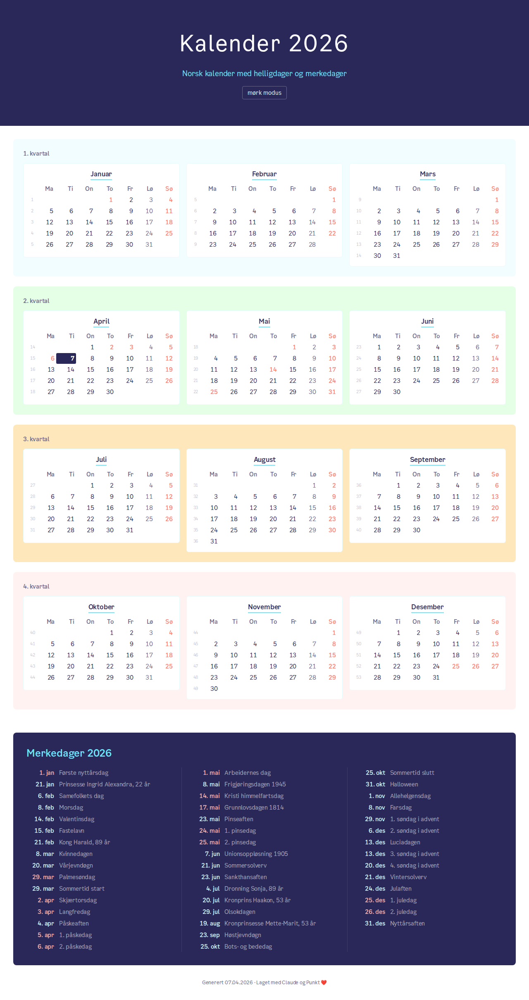

# norcal

A Norwegian calendar for the web, styled with [Punkt](https://punkt.oslo.kommune.no/) (Oslo kommune design system).

Deployed to GitHub Pages and rebuilt daily to keep "today" highlighted.

**[View live](https://falense.github.io/norcal-punkt/)** · [Dark mode](https://falense.github.io/norcal-punkt/#dark)



## Features

- 12-month grid (4x3) with Norwegian month and day names
- ISO week numbers, Monday-first weeks
- Sundays and public holidays in red, Saturdays muted
- Easter-based movable holidays (Computus algorithm)
- Notable dates: royal birthdays, Samefolkets dag, Morsdag, Farsdag, solverv, sommertid, advent, and more
- Today highlighted
- Dark/light mode toggle
- Responsive layout (stacks on mobile)

## How it works

A Python script (`generate.py`) computes all calendar data and renders a Jinja2 template into a static `index.html`. GitHub Actions builds and deploys to GitHub Pages on every push and daily at 01:00 UTC.

## Local development

```bash
uv run --with jinja2 python generate.py        # current year
uv run --with jinja2 python generate.py 2025   # specific year
open dist/index.html
```

## Based on

Forked from [baosen/norcal](https://github.com/baosen/norcal), a Ruby/Tk desktop calendar.

## License

[ISC](LICENSE)
