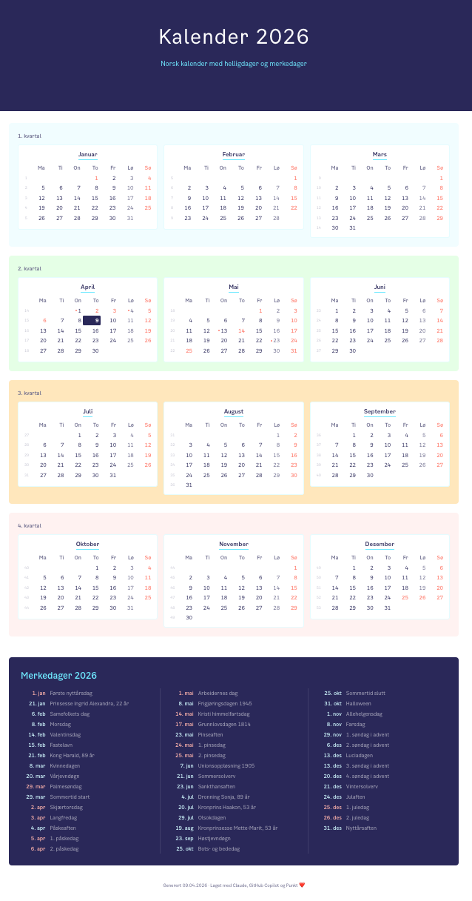
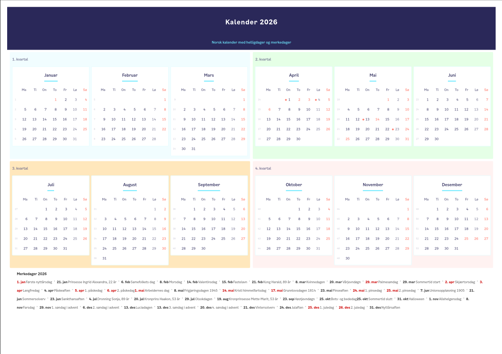

# norcal
A Norwegian calendar for the web, styled with [Punkt](https://punkt.oslo.kommune.no/) (Oslo kommune design system), HTML and JavaScript based.

**[View live](https://wzot.github.io/norcal-punkt-js/)** · [Dark mode](https://wzot.github.io/norcal-punkt-js/#dark)

# Screenshots
## Web

## Print

## Features
- 12-month grid (4x3) with Norwegian month and day names
- ISO week numbers, Monday-first weeks
- Sundays and public holidays in red, Saturdays muted
- Easter-based movable holidays (Computus algorithm)
- Days before movable holidays gets a dot next to the date (as they are not full work days)
- Notable dates: royal birthdays, Samefolkets dag, Morsdag, Farsdag, solverv, sommertid, advent, and more
- Today highlighted
- Dark/light mode toggle
- Responsive layout (stacks on mobile)
- Printable with optimized print stylesheet
- Change year (with URL parameters) or on the website

## How it works
The page computes dates, holidays, ISO weeks, and the current year entirely in the browser. No backend or build step is required — just open the file in a browser.

## Based on
Forked from [falense/norcal-punkt](https://github.com/falense/norcal-punkt) (Python with Punkt design), which is forked from [baosen/norcal](https://github.com/baosen/norcal)  (original Ruby/Tk version).

## License
This project is derived from baosen/norcal and is distributed under the same [ISC license](LICENSE).
